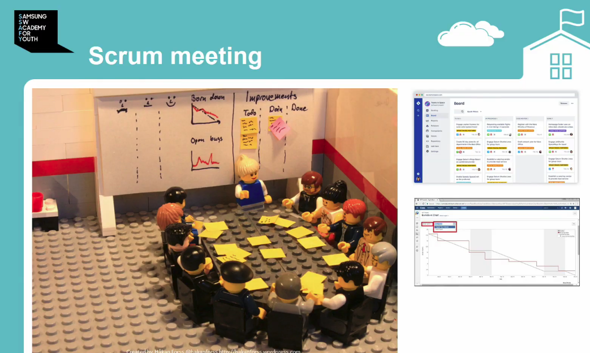
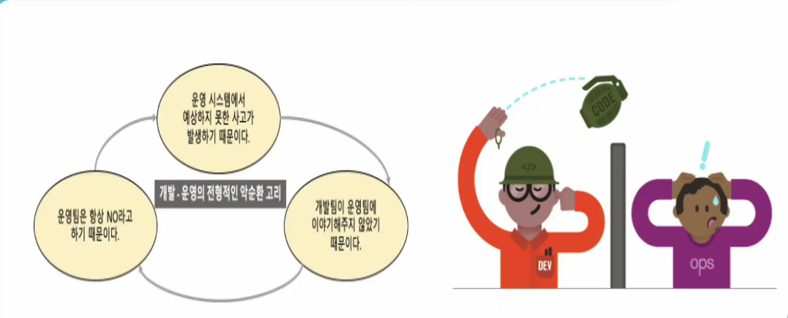
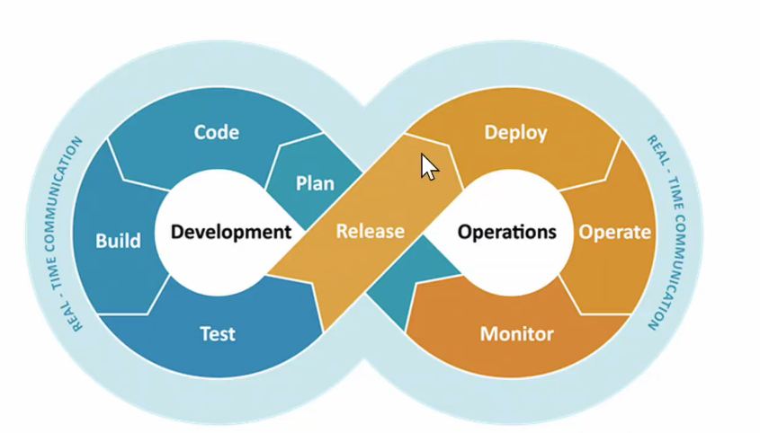
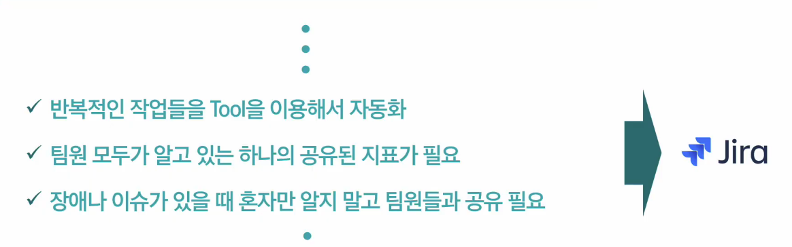
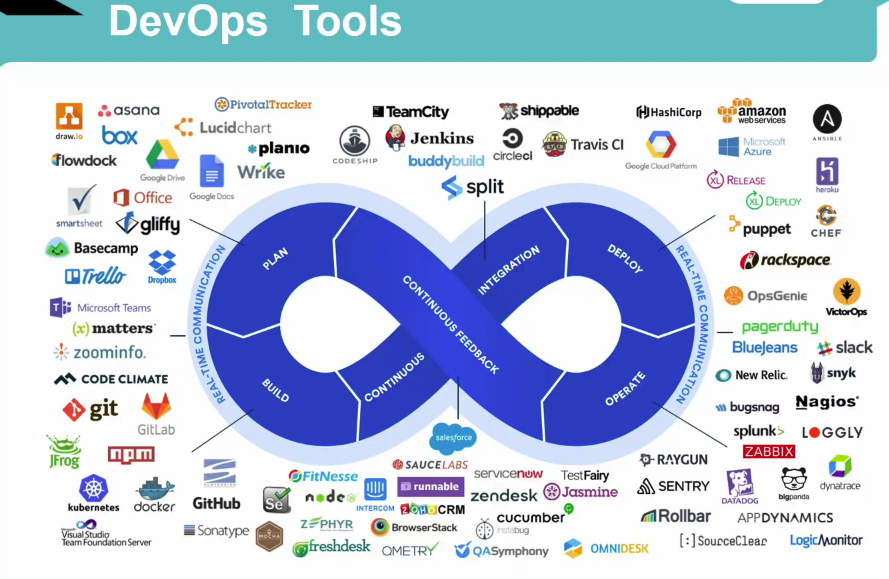

# JIRA

1. 왜 Jira인가
2. Jira & JQL 활용

왜 지라?

1. 이슈 트랙킹
2. 데브옵스(DevOps)
3. 애자일(Agile)
4. SRE

1. 이슈 트랙킹

   개인적으로 todo를 정리하는 것처럼, 팀이 모여서 할 일을 정하는 것을 issue를 정한다 또는 ticket을 정한다라고 함

   할 일 : 모든 것에 해당

   이슈 트랙킹에는 Status(상태)가 존재함.

2. Project Management

   1. 프로젝트 관리 필요
   2. 지라, 이슈 트랙킹을 넘어서 프로젝트 관리까지 할 수 있음

3. Agile

   1. 애자일 소프트웨어 개발 선언

   2. 애자일 할 때 오해하는 점

      1. 애자일은 방법론은 아님, 개발 문화와 같은 형용사에 가까움
      2. SCRUM과 KANBAN 방법론이 있음, 관용적으로 사용하는게 스크럼, 그 다음 칸반
      3. 스크럼 : 스프린트(기간, 2~3주)을 두고 할 일을 백로그에 모두 담고 할 일을 꺼내서 하는 방법론
      4. 칸반 : 스프린트가 따로 없고 전체적인 프로젝트 기간을 두고 이슈에 대한 상태만 관리, 한 번에 일이 몰릴 수 있는 단점이 있어 WPI로 관리 하기도 함

   3. 매일 아침에 모여 스크럼(15분)

      1. 기분이 어떤지, 할 일은 뭐가 남았는지, 현재 겪고 있는 어려움은 무엇인지
      2. 15분보다 더 빠르게 하려면... 서서해라

      

4. DevOps

   1. 예전에는 개발(Dev)와 운영(Ops)가 나누어서 일을 함
   2. 나누어서 일을 하다보니...조직 이기주의 발생

   

   3. 그래서 나온게 DevOps! 개발과 운영을 합쳐보자

   

   4. DevOps를 잘 수행하기 위한 조건

   

5. SRE(Site Reliability Engineering)

   1. 왠만한게 자동화가 됨. 그렇다면 운영팀은 무엇을 할 까?
   2. 신뢰성 공학, 어떻게 하면 리소스를 장애 없이 돌릴 것인가
   3. 컬쳐 : 장애 발생 시 책임을 지우는게 아니라, 모두가 장애를 공유하고 해결에 초점을 맞추자.
   4. Class SRE implements DevOps

------

실제 활용

Task : 실제 할 일

Epic : 이슈들의 큰 틀, 이슈나 태스크를 하나의 모듈로 묶음

버그 : 장애

Summary : 이슈 제목

Reporter : 이슈 생성한 사람

Component/s : 팀 단위, 기능 단위, Components 는 이슈와 달리 따로 화면으로 관리 가능, 리더도 지정 가능

Description : 설명

Priority : 중요도

Labels : 해시태그 느낌, 컴포넌트와 다르게 형식이 없고 쓰고 싶은 만큼 자유롭게 생성가능

Linked Issues : 현재 이슈와 연결된 이슈

Sprint : 스크럼 보드에서 사용하는 스프린트, 현재 이슈를 어디 스프린트에 넣을 것인지

누가봐도 일관성 있는 단위로 Epic을 생성해 관리하는 것이 중요함

------

JQL : Jira Query Language

- Jira Issue를 구조적으로 검색 하기 위해 제공하는 언어
- JQL Operators

